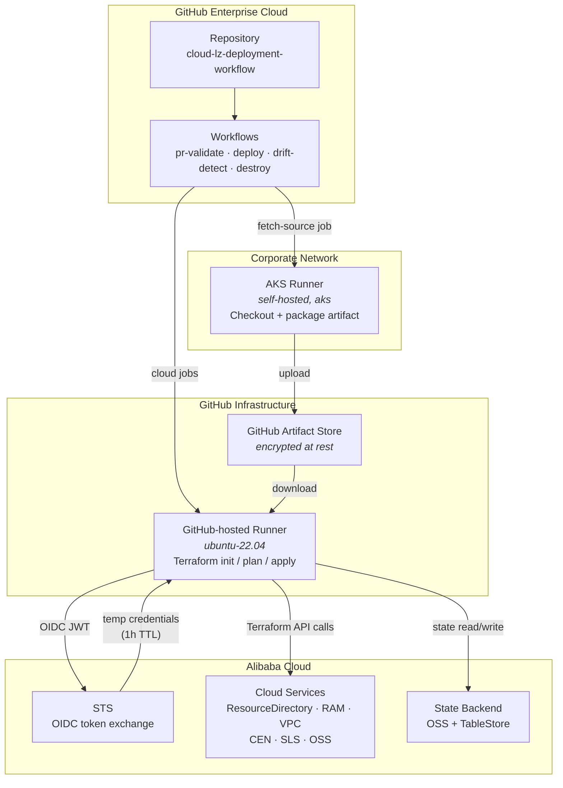
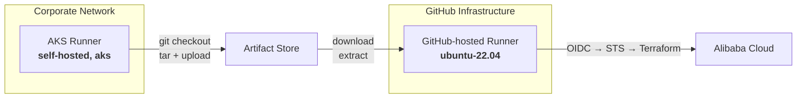
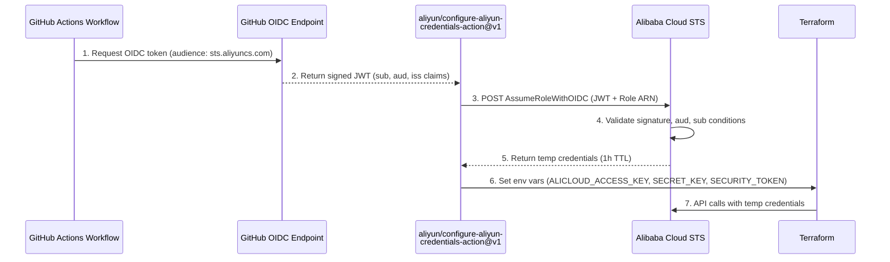
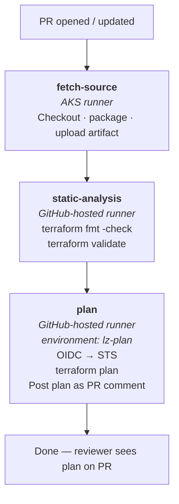
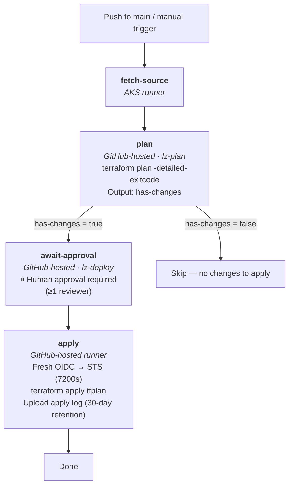
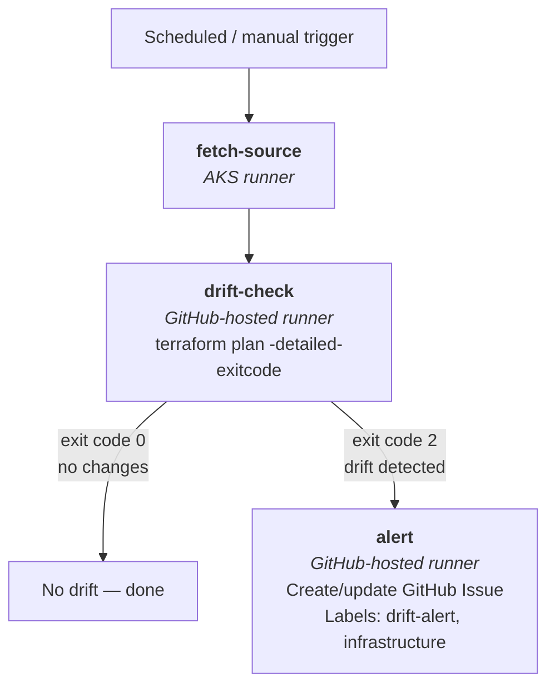
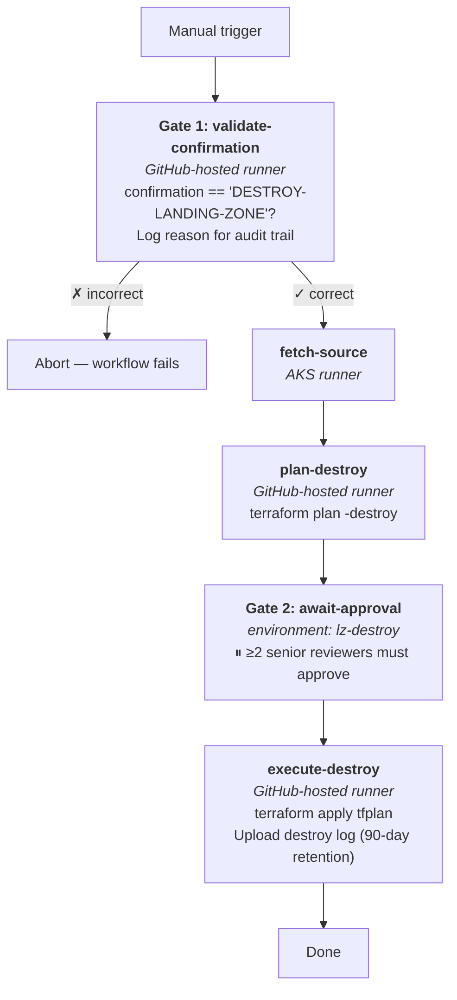
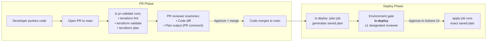
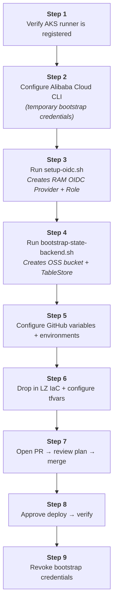

# Alibaba Cloud Landing Zone – Design Document

This document describes the architecture, workflows, and operational procedures
for deploying an Alibaba Cloud Landing Zone (LZ) using Terraform and GitHub
Actions CI/CD.  It is the authoritative reference for the
`cloud-lz-deployment-workflow` repository.

The design assumes a **corporate environment** with GitHub Enterprise Cloud,
an AKS self-hosted runner for code checkout, GitHub-hosted runners for
Terraform operations, and **GitHub OIDC** as the sole authentication mechanism
(no static cloud credentials stored anywhere).

---

## Table of Contents

1. [Architecture Overview](#1-architecture-overview)
2. [Runner Architecture](#2-runner-architecture)
3. [Authentication – GitHub OIDC to Alibaba Cloud](#3-authentication--github-oidc-to-alibaba-cloud)
4. [State Management](#4-state-management)
5. [Repository Structure](#5-repository-structure)
6. [Composite Action – tf-init](#6-composite-action--tf-init)
7. [Workflows](#7-workflows)
8. [Approval Gates and Review Process](#8-approval-gates-and-review-process)
9. [GitHub Repository Configuration](#9-github-repository-configuration)
10. [Day-1 Setup Procedure](#10-day-1-setup-procedure)
11. [Security Controls](#11-security-controls)
12. [Operational Runbook](#12-operational-runbook)
13. [Glossary](#13-glossary)

---

## 1. Architecture Overview



### Data flow summary

1. The **AKS runner** checks out code from the internal GitHub Enterprise
   repository, packages it into a tarball, and uploads it as a GitHub artifact.
2. A **GitHub-hosted runner** downloads the artifact, authenticates to Alibaba
   Cloud via OIDC → STS, and runs Terraform operations against the cloud.
3. Terraform state is stored in Alibaba Cloud OSS with TableStore locking.

---

## 2. Runner Architecture



| Runner | `runs-on` | Network zone | Responsibilities |
|--------|-----------|-------------|-----------------|
| Corporate (AKS) | `[self-hosted, aks]` | Inside corporate network (Azure K8s) | Checkout from internal repos; package IaC source into artifact |
| Cloud (GitHub-hosted) | `ubuntu-22.04` | GitHub infrastructure (full internet) | Terraform init / plan / apply; OIDC token exchange with STS |

### Why two runner types?

Corporate policy prevents GitHub-hosted runners from reaching internal code
repositories and private package registries.  The **AKS runner** handles the
checkout; it never touches Alibaba Cloud.  The **GitHub-hosted runner** receives
only the pre-packaged artifact (never raw source) and authenticates to Alibaba
Cloud via short-lived OIDC tokens – it stores no long-lived credentials.

Because the cloud runner is GitHub-hosted:

- **No VM provisioning** — GitHub manages the runner infrastructure
- **No software installation** — Terraform is installed via `hashicorp/setup-terraform@v3`
- **No network configuration** — full internet access to all required endpoints
- **Ephemeral** — each job gets a fresh, clean environment

---

## 3. Authentication – GitHub OIDC to Alibaba Cloud

No static `AccessKey`/`SecretKey` pairs are stored in GitHub.
Authentication uses the **GitHub OIDC → Alibaba Cloud STS** federation chain.

### Authentication flow



### RAM OIDC Provider configuration

| Field | Value |
|-------|-------|
| Provider name | `GitHubActions` |
| Issuer URL | `https://token.actions.githubusercontent.com` |
| Fingerprint | Fetched dynamically by `scripts/setup-oidc.sh` |
| Allowed audiences | `sts.aliyuncs.com` |

### RAM Role trust policy

```json
{
  "Statement": [
    {
      "Action": "sts:AssumeRoleWithOIDC",
      "Effect": "Allow",
      "Principal": {
        "Federated": ["acs:ram::ACCOUNT_ID:oidc-provider/GitHubActions"]
      },
      "Condition": {
        "StringEquals": {
          "oidc:aud": "sts.aliyuncs.com"
        },
        "StringLike": {
          "oidc:sub": "repo:YOUR_ORG/cloud-lz-deployment-workflow:*"
        }
      }
    }
  ],
  "Version": "1"
}
```

The `StringLike` condition on `oidc:sub` ensures only workflows from **this
specific repository** can assume the role.  Tighten further by restricting to
a specific branch:

```json
"oidc:sub": "repo:YOUR_ORG/cloud-lz-deployment-workflow:ref:refs/heads/main"
```

### Key design decisions

- **Fresh OIDC token per job:** Each job acquires its own STS session, so the
  apply job gets a fresh token even if the approval wait exceeded the plan
  job's token lifetime.
- **Configurable session duration:** The composite action accepts a `duration`
  input (default 3600s, up to 7200s) for long-running operations.
- **Unique session names:** Each job uses a unique `session-name` (e.g.,
  `gh-lz-plan-<run_id>`) to aid audit trail analysis.

---

## 4. State Management

| Component | Alibaba Cloud Service | Purpose |
|-----------|----------------------|---------|
| State file | OSS (Object Storage Service) | Stores `terraform.tfstate` |
| State locking | TableStore (OTS) | Prevents concurrent modifications |

**State key:** `landing-zone/terraform.tfstate`

### Backend configuration

All backend values are injected at runtime via `-backend-config` flags in the
composite action — nothing is hardcoded in `backend.tf`:

| `-backend-config` flag | GitHub Variable |
|------------------------|-----------------|
| `bucket` | `TF_STATE_BUCKET` |
| `prefix` | Hardcoded: `landing-zone/terraform.tfstate` |
| `region` | `ALICLOUD_REGION` |
| `tablestore_endpoint` | `TF_LOCK_TABLESTORE_ENDPOINT` |
| `tablestore_table` | `TF_LOCK_TABLE` |

### State security

- **Encryption at rest:** OSS SSE-AES256
- **Versioning:** Enabled (supports state recovery)
- **Locking:** TableStore prevents concurrent modifications
- **Access control:** OSS bucket ACL is `private`

### TableStore constraints

Table names must comply with `^[a-zA-Z_][a-zA-Z0-9_]{0,254}$` — **no hyphens
allowed**.  The default table name `terraform_lock` satisfies this constraint.

---

## 5. Repository Structure

```
.
├── .github/
│   ├── actions/
│   │   └── tf-init/
│   │       └── action.yml          # Composite: download + setup-terraform + OIDC + init
│   └── workflows/
│       ├── lz-pr-validate.yml      # PR → static analysis + plan
│       ├── lz-deploy.yml           # Merge to main / manual → plan + approve + apply
│       ├── lz-drift-detect.yml     # Daily cron → drift detection + alerting
│       └── lz-destroy.yml          # Manual → confirmation + approve + destroy
│
├── terraform/
│   └── environments/
│       └── landing-zone/
│           ├── backend.tf                    # OSS backend template (values injected at runtime)
│           ├── landing-zone.tfvars.example   # Reference variable template
│           └── <Alibaba LZ IaC files>        # Provided by Alibaba Cloud
│
├── scripts/
│   ├── setup-oidc.sh                # Day-1: creates RAM OIDC Provider + Deployment Role
│   ├── bootstrap-state-backend.sh   # Day-1: creates OSS bucket + TableStore instance/table
│   └── validate-prereqs.sh          # CI validation: checks tools + env vars + OIDC
│
├── DESIGN.md                        # This document
└── README.md                        # Operational guide
```

---

## 6. Composite Action – tf-init

**File:** `.github/actions/tf-init/action.yml`

This composite action centralises the Terraform initialisation logic used by
every cloud-runner job.  It eliminates duplication across workflows.

### Inputs

| Input | Required | Default | Description |
|-------|----------|---------|-------------|
| `artifact-name` | Yes | — | Source artifact name from the `fetch-source` job |
| `session-name` | Yes | — | STS role session name (must be unique per job) |
| `working-dir` | Yes | — | Terraform working directory relative to repo root |
| `duration` | No | `3600` | STS session duration in seconds (max 7200) |

### Steps (in order)

1. **Download artifact** — `actions/download-artifact@v4`
2. **Extract source** — `tar -xzf lz-source.tar.gz`
3. **Setup Terraform** — `hashicorp/setup-terraform@v3` (version 1.9.5,
   `terraform_wrapper: false` for manual exit code handling)
4. **OIDC authentication** — `aliyun/configure-aliyun-credentials-action@v1`
   - Uses `vars.ALICLOUD_OIDC_ROLE_ARN` and `vars.ALICLOUD_OIDC_PROVIDER_ARN`
   - Sets `ALICLOUD_ACCESS_KEY`, `ALICLOUD_SECRET_KEY`,
     `ALICLOUD_SECURITY_TOKEN`, and `ALICLOUD_REGION` as environment variables
5. **Terraform init** — runs `terraform init` with backend config flags
   injected from GitHub repository variables

### Why `terraform_wrapper: false`?

The default Terraform wrapper intercepts exit codes for GitHub Actions
annotations.  We disable it so workflows can inspect raw exit codes (e.g.,
`-detailed-exitcode` returns 2 for changes detected).

---

## 7. Workflows

### 7.1 `lz-pr-validate.yml` – PR Validation

**Trigger:** Pull requests to `main` modifying `terraform/**` or `.github/**`

**Permissions:** `contents: read`, `id-token: write`, `pull-requests: write`

**Concurrency:** `lz-pr-<PR_NUMBER>`, `cancel-in-progress: true`



**Outcome:** Reviewer sees the Terraform plan inline on the PR before
approving merge.

---

### 7.2 `lz-deploy.yml` – Deploy

**Trigger:** Push to `main` (changes to `terraform/**`) or `workflow_dispatch`
with optional `-target` parameter

**Permissions:** `contents: read`, `id-token: write`, `deployments: write`

**Concurrency:** `lz-deploy`, `cancel-in-progress: false`



**Key design decisions:**

- **Plan-then-apply with saved binary:** The exact plan artifact is applied —
  no re-plan on apply.  What was reviewed is what gets deployed.
- **Skips apply on no-op:** If `terraform plan` detects no changes (exit
  code 0), the approval and apply jobs are skipped.
- **Fresh OIDC per job:** The apply job gets its own STS token (2-hour
  duration) since the approval wait may exceed the plan job's 1-hour TTL.
- **Concurrency protection:** `cancel-in-progress: false` prevents a
  subsequent push from cancelling a deploy mid-apply.

---

### 7.3 `lz-drift-detect.yml` – Drift Detection

**Trigger:** Cron schedule `0 4 * * *` (04:00 UTC daily) or `workflow_dispatch`

**Permissions:** `contents: read`, `id-token: write`, `issues: write`



**Key details:**
- A single open drift issue is maintained — new detections are added as
  comments rather than creating duplicate issues
- Drift reports are retained as artifacts for 14 days

---

### 7.4 `lz-destroy.yml` – Emergency Destroy

**Trigger:** `workflow_dispatch` only (manual)

**Inputs:**
- `confirmation` (required): Must equal `DESTROY-LANDING-ZONE`
- `reason` (required): Free-text reason captured in audit logs

**Concurrency:** `lz-destroy`, `cancel-in-progress: false`



**Use only for:** Full environment decommission or DR exercises.

---

## 8. Approval Gates and Review Process

The pipeline implements a layered protection model that prevents unauthorised
or accidental changes to cloud infrastructure.  Every change passes through
multiple checkpoints before reaching production.

### How the review process works



### Gate types explained

The pipeline uses three distinct gate mechanisms:

#### Gate 1 — Pull Request Review (code + plan review)

- **Who reviews:** Any team member with repository write access
- **What they review:**
  - The IaC code diff itself (syntax, logic, best practices)
  - The Terraform plan posted as a PR comment (what will actually change)
- **How to approve:** Standard GitHub PR approval workflow
- **When it runs:** On every PR that modifies `terraform/**` or `.github/**`
- **Protection:** Branch protection rules prevent merging without approval and
  passing status checks (`Static Analysis`, `Terraform Plan`)

#### Gate 2 — Deployment Environment Approval (deploy gate)

- **Who reviews:** Designated reviewers configured on the `lz-deploy`
  GitHub Environment (minimum 1 reviewer, typically a platform lead or team)
- **What they review:** The workflow run summary showing the plan output
- **How to approve:** Go to **Actions → the workflow run → Review deployments
  → Approve**
- **When it runs:** After the plan job in `lz-deploy.yml` (only if changes
  are detected)
- **Protection:** Only the exact saved plan artifact is applied — no re-plan
  occurs between approval and apply

This is the "are you sure?" gate.  The reviewer has already seen the plan
during PR review; this gate confirms the deployment should proceed now.

#### Gate 3 — Destroy Environment Approval (destroy gate)

- **Who reviews:** ≥2 senior team members configured on the `lz-destroy`
  GitHub Environment
- **What they review:** The destroy plan + the stated reason
- **How to approve:** Same workflow approval UI; both reviewers must approve
- **Additional protection:** A confirmation string (`DESTROY-LANDING-ZONE`)
  must be typed correctly before the workflow even starts

### Why double-gating on deploys?

A single PR approval is not sufficient because:

1. **Time gap:** Hours or days may pass between PR merge and the actual apply.
   Conditions may have changed.
2. **Blast radius awareness:** The person merging a PR may not be the person
   responsible for production changes.  The environment gate ensures a
   designated platform owner explicitly authorises the deploy.
3. **Exact-plan guarantee:** The environment gate is placed *after* the plan
   job.  This means the reviewer sees the actual plan that will be applied,
   not just the code that generated it.

### Why triple-gating on destroys?

Destroying a landing zone is an irreversible, high-impact operation:

1. **Confirmation string** prevents accidental triggers via the GitHub UI
2. **Destroy plan review** shows exactly what will be removed
3. **Two senior reviewers** must both approve — no single person can authorise
   destruction

### Summary of all gates

| Workflow | Gate 1 (PR) | Gate 2 (Environment) | Gate 3 (Confirmation) |
|----------|-------------|---------------------|-----------------------|
| PR Validate | PR approval + status checks | `lz-plan` (no reviewers) | — |
| Deploy | PR approval + status checks | `lz-deploy` (≥1 reviewer) | — |
| Drift Detect | — | — | — |
| Destroy | — | `lz-destroy` (≥2 reviewers) | `DESTROY-LANDING-ZONE` input |

---

## 9. GitHub Repository Configuration

### Required permissions

All workflows require `id-token: write` at the workflow level.  The GitHub
Enterprise Cloud organisation policy must **not** block OIDC token generation.

### Variables (Settings → Secrets and variables → Actions → Variables)

These are non-sensitive and stored as plain variables, not secrets.

| Variable | Description | Example |
|----------|-------------|---------|
| `ALICLOUD_REGION` | Primary deployment region | `cn-hangzhou` |
| `ALICLOUD_OIDC_PROVIDER_ARN` | Full ARN of the RAM OIDC Provider | `acs:ram::123456789012:oidc-provider/GitHubActions` |
| `ALICLOUD_OIDC_ROLE_ARN` | Full ARN of the deployment RAM Role | `acs:ram::123456789012:role/github-lz-deploy` |
| `TF_STATE_BUCKET` | OSS bucket name for Terraform state | `acme-lz-tfstate` |
| `TF_LOCK_TABLESTORE_ENDPOINT` | TableStore HTTPS endpoint | `https://acme-lz-tflock.cn-hangzhou.ots.aliyuncs.com` |
| `TF_LOCK_TABLE` | TableStore table name for locking | `terraform_lock` |

### Environments (Settings → Environments)

#### `lz-plan`
- **Required reviewers:** None
- **Allowed branches:** `main`, `feature/*`
- **Purpose:** Provides separation of OIDC session for plan operations

#### `lz-deploy`
- **Required reviewers:** Minimum 1 (e.g., platform-lead or a team)
- **Allowed branches:** `main` only
- **Wait timer:** Optional (e.g., 5 minutes for last-chance cancel)
- **Purpose:** Human approval gate before `terraform apply`

#### `lz-destroy`
- **Required reviewers:** Minimum 2 (senior team members)
- **Allowed branches:** `main` only
- **Purpose:** Approval gate for destructive operations

### Branch protection (Settings → Branches → `main`)

| Rule | Value |
|------|-------|
| Require PR before merging | Yes |
| Require status checks | `Static Analysis`, `Terraform Plan` |
| Require branches to be up to date | Yes |
| Restrict force pushes | Yes |
| Restrict deletions | Yes |

---

## 10. Day-1 Setup Procedure

This section covers the one-time setup required before the pipeline can run.



### Step 1 – Verify the AKS runner is registered

Ensure the AKS self-hosted runner is registered in GitHub Enterprise with
labels `self-hosted, aks`.  Refer to your organisation's AKS runner
documentation for provisioning details.

Verify the runner appears as **Idle** in:
**Org → Settings → Actions → Runners**

Cloud jobs use GitHub-hosted runners (`ubuntu-22.04`) and require no setup.

### Step 2 – Configure Alibaba Cloud CLI

On your workstation:

```bash
aliyun configure
# Enter: AccessKey ID, AccessKey Secret, Region (e.g. cn-hangzhou)
```

These credentials are temporary — used only for Steps 3–4 and revoked in
Step 9.  The account needs RAM admin permissions.

### Step 3 – Create OIDC Provider and Deployment Role

```bash
export ALICLOUD_ACCOUNT_ID="<your-account-id>"
export GITHUB_ORG="<your-github-org>"
export GITHUB_REPO="cloud-lz-deployment-workflow"
export ALICLOUD_REGION="cn-hangzhou"

./scripts/setup-oidc.sh
```

The script is idempotent.  It outputs three values — save them for Step 5.

### Step 4 – Bootstrap Terraform State Backend

```bash
export ALICLOUD_ACCOUNT_ID="<your-account-id>"
export ALICLOUD_REGION="cn-hangzhou"
export STATE_BUCKET_NAME="<your-org>-lz-tfstate"
export TABLESTORE_INSTANCE="<your-org>-lz-tflock"
export TABLESTORE_TABLE="terraform_lock"

./scripts/bootstrap-state-backend.sh
```

The script creates: OSS bucket (private, versioned, encrypted), TableStore
instance, and lock table.  It outputs three values — save them for Step 5.

### Step 5 – Configure GitHub repository

**Add all six variables** to GitHub repo → Settings → Variables:

| Variable | Source |
|----------|--------|
| `ALICLOUD_REGION` | Step 3 |
| `ALICLOUD_OIDC_PROVIDER_ARN` | Step 3 |
| `ALICLOUD_OIDC_ROLE_ARN` | Step 3 |
| `TF_STATE_BUCKET` | Step 4 |
| `TF_LOCK_TABLESTORE_ENDPOINT` | Step 4 |
| `TF_LOCK_TABLE` | Step 4 |

**Create three environments** (see §9 for protection rules):
`lz-plan`, `lz-deploy`, `lz-destroy`

**Configure branch protection** on `main` (see §9).

### Step 6 – Drop in LZ IaC and configure variables

Place the Alibaba Cloud–provided LZ IaC files into
`terraform/environments/landing-zone/`.

```bash
cp terraform/environments/landing-zone/landing-zone.tfvars.example \
   terraform/environments/landing-zone/landing-zone.tfvars
# Edit landing-zone.tfvars — fill in account IDs, CIDRs, names, etc.
```

### Step 7 – Open a PR and review the plan

```bash
git checkout -b feat/initial-lz-config
git add terraform/environments/landing-zone/
git commit -m "chore: initial landing zone variable configuration"
git push -u origin feat/initial-lz-config
```

This triggers `lz-pr-validate`, which runs static analysis and posts a
Terraform plan as a PR comment.  Review the plan to confirm what will be
created, then approve and merge to `main`.

### Step 8 – Approve the deploy and verify

Merging to `main` triggers `lz-deploy.yml`.  The workflow pauses at the
`lz-deploy` environment gate.

1. Go to **Actions → the workflow run → Review deployments → Approve**
2. Monitor the apply job output
3. Verify in the Alibaba Cloud console that expected resources exist

```bash
# Confirm state was written
aliyun oss ls oss://<STATE_BUCKET_NAME>/landing-zone/
```

### Step 9 – Revoke bootstrap credentials

The static credentials from Step 2 are no longer needed:

```bash
aliyun ram UpdateAccessKey \
  --UserName <bootstrap-user> \
  --UserAccessKeyId <AK_ID> \
  --Status Inactive
```

All subsequent pipeline runs authenticate exclusively via OIDC → STS.

---

## 11. Security Controls

| # | Control | Implementation |
|---|---------|---------------|
| 1 | No static credentials | GitHub OIDC → STS temp credentials (1h TTL) |
| 2 | Least-privilege role | RAM Role with scoped policy (tighten `AdministratorAccess` post-bootstrap) |
| 3 | Deployment approval | GitHub Environment `lz-deploy` with required reviewers |
| 4 | Branch protection | PRs + status checks required on `main` |
| 5 | Plan-then-apply | Exact plan binary applied; no re-plan on apply |
| 6 | Destroy triple-gate | Confirmation string + destroy plan + `lz-destroy` environment (≥2 reviewers) |
| 7 | Drift detection | Daily terraform plan; auto-issue on drift |
| 8 | Artifact integrity | Source packaged by AKS runner; GitHub-hosted runner downloads the same artifact |
| 9 | State encryption | OSS SSE-AES256 at rest |
| 10 | State versioning | OSS bucket versioning enabled (state recovery) |
| 11 | Audit trail | Workflow logs + apply log artifacts (30d retention, 90d for destroy) |
| 12 | Concurrency prevention | `concurrency` group with `cancel-in-progress: false` |

### Hardening the RAM Role (post-Day-1)

After the first successful deployment, replace `AdministratorAccess` with a
scoped custom policy.  Typical LZ services:

```
ResourceDirectory:*  RAM:*  VPC:*  CEN:*  SLS:*
OSS:PutObject,GetObject,...  ActionTrail:*  CloudMonitor:*  OTS:*
```

```bash
aliyun ram CreatePolicy \
  --PolicyName "github-lz-deploy-policy" \
  --PolicyDocument file://docs/iam-policy.json

aliyun ram DetachPolicyFromRole \
  --PolicyType System --PolicyName AdministratorAccess \
  --RoleName github-lz-deploy

aliyun ram AttachPolicyToRole \
  --PolicyType Custom --PolicyName github-lz-deploy-policy \
  --RoleName github-lz-deploy
```

---

## 12. Operational Runbook

### Deploying a change

1. Create a feature branch and modify IaC code.
2. Open a PR → `lz-pr-validate` runs automatically.
3. Review the plan posted as a PR comment.
4. Merge to `main` → `lz-deploy` triggers.
5. Approve the `lz-deploy` environment gate.
6. Monitor the apply job.

### Emergency targeted deployment

```bash
gh workflow run lz-deploy.yml --field target="module.network_foundation" --ref main
```

### Checking for drift manually

```bash
gh workflow run lz-drift-detect.yml --ref main
```

### Recovering from a failed apply

1. Check the apply log artifact in the failed run.
2. Fix the root cause in a feature branch → PR → merge.
3. If state is locked: `terraform force-unlock <LOCK_ID>`

### Rotating the deployment role

1. Re-run `./scripts/setup-oidc.sh` (idempotent).
2. If the role ARN changes, update `ALICLOUD_OIDC_ROLE_ARN` in GitHub variables.

---

## 13. Glossary

| Term | Meaning |
|------|---------|
| LZ | Landing Zone — foundational Alibaba Cloud account/network structure |
| OIDC | OpenID Connect — used for keyless GitHub → Alibaba Cloud auth |
| STS | Security Token Service — issues temp credentials from OIDC tokens |
| RAM | Resource Access Management — Alibaba Cloud identity and access service |
| OSS | Object Storage Service — Alibaba Cloud blob storage |
| OTS / TableStore | Alibaba Cloud NoSQL service, used for Terraform state locking |
| CEN | Cloud Enterprise Network — Alibaba Cloud transit routing |
| SLS | Simple Log Service — centralised logging |
| ActionTrail | Alibaba Cloud audit log service (equivalent of CloudTrail) |
| AKS | Azure Kubernetes Service — hosts the corporate self-hosted runner |
