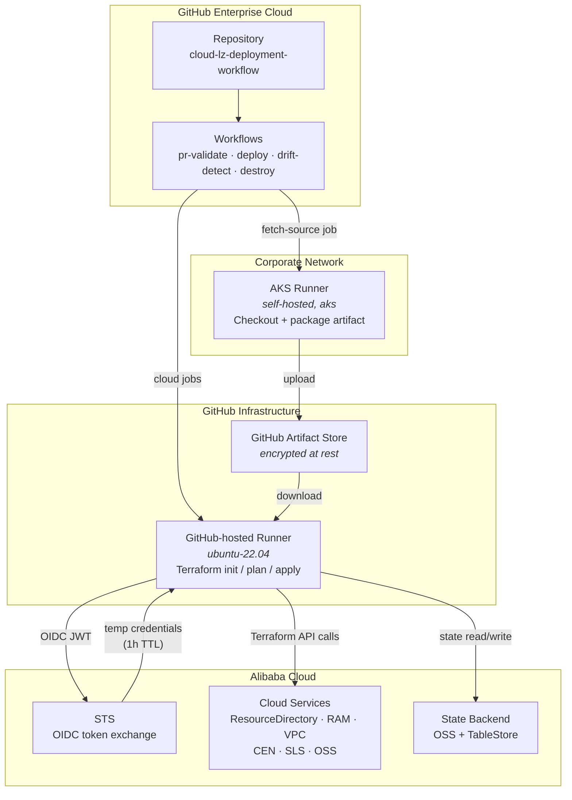
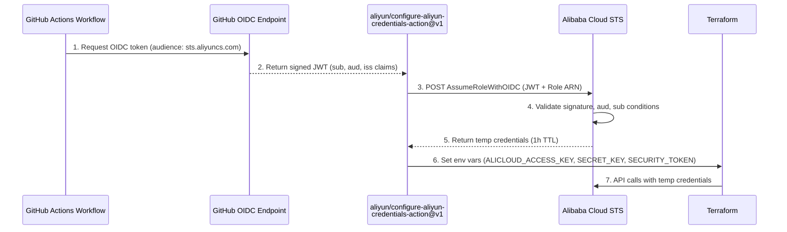
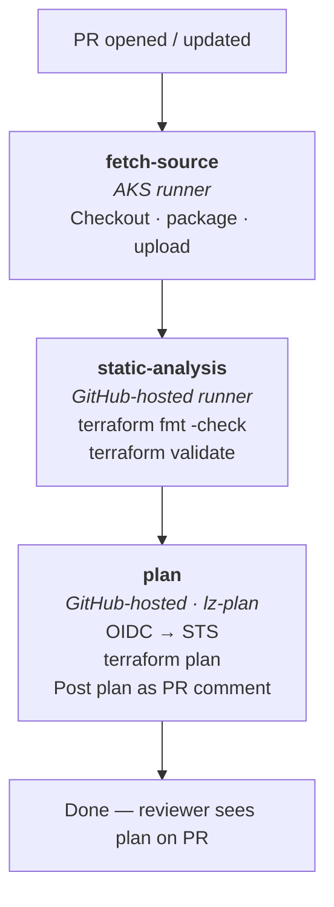
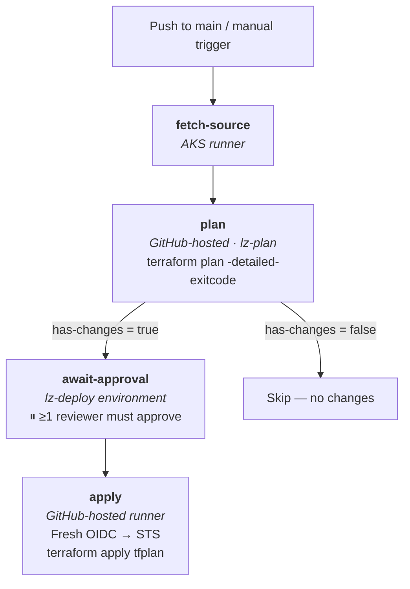
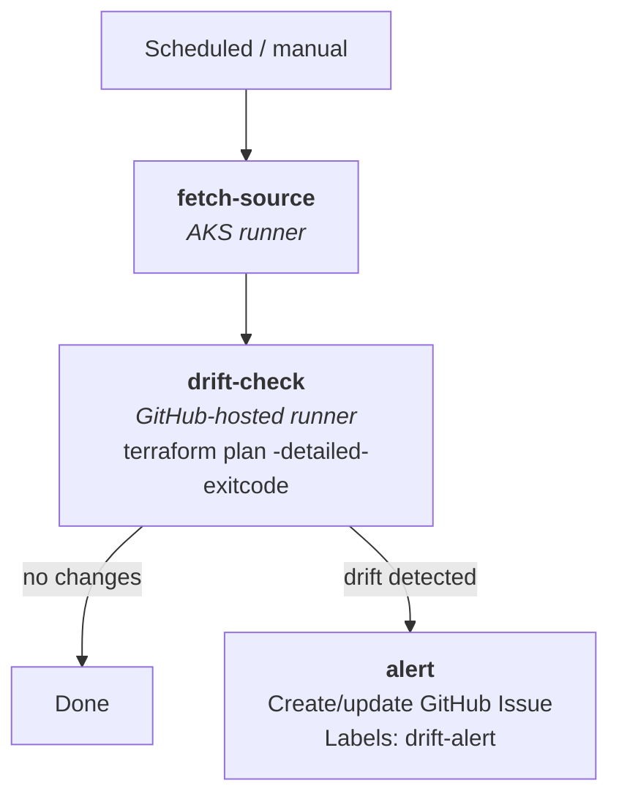
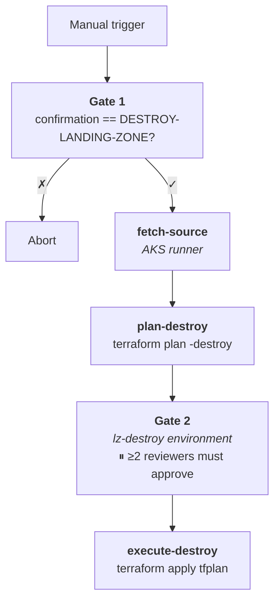
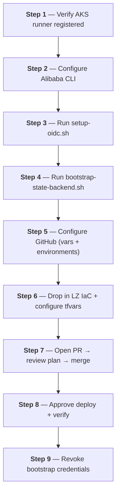

# Alibaba Cloud Landing Zone – Deployment Workflow

GitHub Actions–based CI/CD pipeline for deploying and managing an Alibaba Cloud
Landing Zone (LZ) from IaC code.  The design assumes a **corporate environment**
with GitHub Enterprise Cloud, an AKS self-hosted runner for code checkout, and
GitHub-hosted runners for Terraform operations.  Authentication uses
**GitHub OIDC** (no static cloud credentials stored anywhere).

> For full architectural details, see [DESIGN.md](DESIGN.md).

---

## Table of Contents

1. [Architecture Overview](#1-architecture-overview)
2. [Runner Architecture](#2-runner-architecture)
3. [Authentication – GitHub OIDC to Alibaba Cloud](#3-authentication--github-oidc-to-alibaba-cloud)
4. [Repository Structure](#4-repository-structure)
5. [GitHub Repository Configuration](#5-github-repository-configuration)
6. [Workflows](#6-workflows)
7. [Day-1 Setup Procedure](#7-day-1-setup-procedure)
8. [State Backend](#8-state-backend)
9. [Security Controls](#9-security-controls)
10. [Operational Runbook](#10-operational-runbook)

---

## 1. Architecture Overview



---

## 2. Runner Architecture

| Runner | `runs-on` | Responsibilities |
|--------|-----------|-----------------|
| Corporate (AKS) | `[self-hosted, aks]` | Checkout from internal repos; package IaC source into artifact |
| Cloud (GitHub-hosted) | `ubuntu-22.04` | Terraform init / plan / apply; OIDC token exchange with STS |

### Why two runner types?

Corporate policy prevents GitHub-hosted runners from reaching internal code
repositories and private package registries.  The **AKS runner** handles
the checkout; it never touches Alibaba Cloud.  The **GitHub-hosted runner**
receives only the pre-packaged artifact (never raw source) and authenticates
to Alibaba Cloud via short-lived OIDC tokens – it stores no long-lived
credentials.

Because the cloud runner is GitHub-hosted, there is no VM provisioning,
software installation, or network configuration required.  Terraform is
installed via `hashicorp/setup-terraform@v3` in the composite action.

---

## 3. Authentication – GitHub OIDC to Alibaba Cloud

No static `AccessKey`/`SecretKey` pairs are stored in GitHub Secrets.
Authentication uses the **GitHub OIDC → Alibaba Cloud STS** federation chain.

### How it works



### RAM OIDC Provider configuration

| Field | Value |
|-------|-------|
| Provider name | `GitHubActions` |
| Issuer URL | `https://token.actions.githubusercontent.com` |
| Fingerprint | Fetched dynamically by `setup-oidc.sh` |
| Allowed audiences | `sts.aliyuncs.com` |

### RAM Role trust policy

```json
{
  "Statement": [
    {
      "Action": "sts:AssumeRoleWithOIDC",
      "Effect": "Allow",
      "Principal": {
        "Federated": ["acs:ram::ACCOUNT_ID:oidc-provider/GitHubActions"]
      },
      "Condition": {
        "StringEquals": {
          "oidc:aud": "sts.aliyuncs.com"
        },
        "StringLike": {
          "oidc:sub": "repo:YOUR_ORG/cloud-lz-deployment-workflow:*"
        }
      }
    }
  ],
  "Version": "1"
}
```

### One-time setup

```bash
export ALICLOUD_ACCOUNT_ID="123456789012"
export GITHUB_ORG="your-org"
export GITHUB_REPO="cloud-lz-deployment-workflow"
export ALICLOUD_REGION="cn-hangzhou"

./scripts/setup-oidc.sh
```

The script outputs the three GitHub variable values to configure (see §5).

---

## 4. Repository Structure

```
.
├── .github/
│   ├── actions/
│   │   └── tf-init/
│   │       └── action.yml          # Composite: download + setup-terraform + OIDC + init
│   └── workflows/
│       ├── lz-pr-validate.yml      # PR → static analysis + plan
│       ├── lz-deploy.yml           # Merge to main / manual → plan + approve + apply
│       ├── lz-drift-detect.yml     # Daily cron → drift detection + alerting
│       └── lz-destroy.yml          # Manual → confirmation + approve + destroy
│
├── terraform/
│   └── environments/
│       └── landing-zone/
│           ├── backend.tf                    # OSS backend template (values injected at runtime)
│           ├── landing-zone.tfvars.example   # Reference variable template
│           └── <Alibaba LZ IaC files>        # Provided by Alibaba Cloud
│
├── scripts/
│   ├── setup-oidc.sh                # Day-1: creates RAM OIDC Provider + Deployment Role
│   ├── bootstrap-state-backend.sh   # Day-1: creates OSS bucket + TableStore instance/table
│   └── validate-prereqs.sh          # CI validation: checks tools + env vars + OIDC
│
├── DESIGN.md                        # Architecture and design document
└── README.md                        # This file
```

---

## 5. GitHub Repository Configuration

### Variables (Settings → Secrets and variables → Actions → Variables)

These are non-sensitive and stored as plain variables, not secrets.

| Variable | Description | Example |
|----------|-------------|---------|
| `ALICLOUD_REGION` | Primary deployment region | `cn-hangzhou` |
| `ALICLOUD_OIDC_PROVIDER_ARN` | Full ARN of the RAM OIDC Provider | `acs:ram::123456789012:oidc-provider/GitHubActions` |
| `ALICLOUD_OIDC_ROLE_ARN` | Full ARN of the deployment RAM Role | `acs:ram::123456789012:role/github-lz-deploy` |
| `TF_STATE_BUCKET` | OSS bucket name for Terraform state | `acme-lz-tfstate` |
| `TF_LOCK_TABLESTORE_ENDPOINT` | TableStore HTTPS endpoint | `https://acme-lz-tflock.cn-hangzhou.ots.aliyuncs.com` |
| `TF_LOCK_TABLE` | TableStore table name for locking | `terraform_lock` |

### Environments (Settings → Environments)

| Environment | Required reviewers | Allowed branches | Purpose |
|-------------|-------------------|-----------------|---------|
| `lz-plan` | None | `main`, `feature/*` | OIDC session separation for plan jobs |
| `lz-deploy` | ≥1 (platform-lead / team) | `main` only | Human approval gate before apply |
| `lz-destroy` | ≥2 (senior team members) | `main` only | Approval gate for destructive operations |

### Branch Protection (Settings → Branches → `main`)

| Rule | Value |
|------|-------|
| Require PR before merging | Yes |
| Require status checks | `Static Analysis`, `Terraform Plan` |
| Require branches to be up to date | Yes |
| Restrict force pushes | Yes |
| Restrict deletions | Yes |

---

## 6. Workflows

### `lz-pr-validate.yml` – PR Validation

Runs on every PR targeting `main` that modifies `terraform/**` or `.github/**`.



---

### `lz-deploy.yml` – Deploy

Triggers on push to `main` (IaC changes) or `workflow_dispatch` (manual).



Key design decisions:
- The **exact plan binary** is applied – no re-plan on apply.
- `concurrency: cancel-in-progress: false` prevents mid-deploy cancellation.
- Fresh OIDC token for apply (approval wait may exceed 1h TTL).

---

### `lz-drift-detect.yml` – Drift Detection

Runs daily at 04:00 UTC or manually.



---

### `lz-destroy.yml` – Emergency Destroy

**Manual trigger only.** Triple-gated:



Use only for full environment decommission or DR exercises.

---

## 7. Day-1 Setup Procedure

Follow these steps **in order**.



### Step 1 – Verify the AKS runner is registered

Ensure the AKS self-hosted runner is registered in GitHub Enterprise with
labels `self-hosted, aks`.  Verify it appears as **Idle** in:
**Org → Settings → Actions → Runners**

Cloud jobs use GitHub-hosted runners and require no setup.

### Step 2 – Configure Alibaba Cloud CLI

```bash
aliyun configure
# Enter: AccessKey ID, AccessKey Secret, Region (e.g. cn-hangzhou)
# Temporary — revoked in Step 9.
```

### Step 3 – Create OIDC Provider and Deployment Role

```bash
export ALICLOUD_ACCOUNT_ID="<your-account-id>"
export GITHUB_ORG="<your-github-org>"
export GITHUB_REPO="cloud-lz-deployment-workflow"
export ALICLOUD_REGION="cn-hangzhou"

./scripts/setup-oidc.sh
```

Save the three output values for Step 5.

### Step 4 – Bootstrap Terraform State Backend

```bash
export ALICLOUD_ACCOUNT_ID="<your-account-id>"
export ALICLOUD_REGION="cn-hangzhou"
export STATE_BUCKET_NAME="<your-org>-lz-tfstate"
export TABLESTORE_INSTANCE="<your-org>-lz-tflock"
export TABLESTORE_TABLE="terraform_lock"

./scripts/bootstrap-state-backend.sh
```

Save the three output values for Step 5.

### Step 5 – Configure GitHub repository

Add all six variables from Steps 3–4 to **Settings → Variables**.
Create environments `lz-plan`, `lz-deploy`, `lz-destroy` (see §5).
Configure branch protection on `main` (see §5).

### Step 6 – Drop in IaC and configure variables

Place the Alibaba Cloud LZ IaC files into `terraform/environments/landing-zone/`.

```bash
cp terraform/environments/landing-zone/landing-zone.tfvars.example \
   terraform/environments/landing-zone/landing-zone.tfvars
# Edit landing-zone.tfvars — fill in account IDs, CIDRs, names, etc.
```

### Step 7 – Open a PR and review

```bash
git checkout -b feat/initial-lz-config
git add terraform/environments/landing-zone/
git commit -m "chore: initial landing zone variable configuration"
git push -u origin feat/initial-lz-config
```

This triggers `lz-pr-validate` — review the plan posted as a PR comment,
then approve and merge to `main`.

### Step 8 – Approve deploy and verify

Merging triggers `lz-deploy`.  Approve the `lz-deploy` environment gate.

```bash
# After deploy completes, verify state was written:
aliyun oss ls oss://<STATE_BUCKET_NAME>/landing-zone/
```

Confirm expected resources exist in the Alibaba Cloud console.

### Step 9 – Revoke bootstrap credentials

```bash
aliyun ram UpdateAccessKey \
  --UserName <bootstrap-user> \
  --UserAccessKeyId <AK_ID> \
  --Status Inactive
```

All subsequent operations authenticate via OIDC → STS.

---

## 8. State Backend

| Component | Alibaba Cloud Service | Purpose |
|-----------|----------------------|---------|
| State file | OSS (Object Storage) | Stores `terraform.tfstate` |
| State locking | TableStore (OTS) | Prevents concurrent modifications |

**State key**: `landing-zone/terraform.tfstate`

Backend configuration is injected at runtime via `-backend-config` flags –
no sensitive values are hardcoded in `backend.tf`.

### State recovery

```bash
# Force-unlock (confirm no other operation is running first)
terraform force-unlock <LOCK_ID>
```

OSS versioning is enabled — previous state versions can be recovered from
the OSS console.

---

## 9. Security Controls

| Control | Implementation |
|---------|---------------|
| No static credentials | GitHub OIDC → STS temp credentials (1h TTL) |
| Least-privilege role | RAM Role (tighten `AdministratorAccess` post-bootstrap) |
| Deploy approval gate | GitHub Environment `lz-deploy` (≥1 reviewer) |
| Branch protection | PRs + status checks required on `main` |
| Plan-then-apply | Exact plan binary applied; no re-plan on apply |
| Destroy triple-gate | Confirmation string + destroy plan + `lz-destroy` (≥2 reviewers) |
| Drift detection | Daily terraform plan; auto-issue on drift |
| Artifact integrity | Source packaged by AKS runner; downloaded by GitHub-hosted runner |
| State encryption | OSS SSE-AES256 at rest |
| State versioning | OSS bucket versioning (state recovery) |
| Audit trail | Workflow logs + apply artifacts (30d retention, 90d for destroy) |
| Concurrency prevention | `concurrency` group with `cancel-in-progress: false` |

See [DESIGN.md §8](DESIGN.md#8-approval-gates-and-review-process) for a
detailed explanation of the approval gates and review process.

---

## 10. Operational Runbook

### Deploying a change

1. Create a feature branch and modify IaC code.
2. Open a PR → `lz-pr-validate` runs automatically.
3. Review the plan posted as a PR comment.
4. Merge to `main` → `lz-deploy` triggers.
5. Approve the `lz-deploy` environment gate.
6. Monitor the apply job.

### Emergency targeted deployment

```bash
gh workflow run lz-deploy.yml --field target="module.network_foundation" --ref main
```

### Checking for drift manually

```bash
gh workflow run lz-drift-detect.yml --ref main
```

### Recovering from a failed apply

1. Check the apply log artifact in the failed run.
2. Fix the root cause in a feature branch → PR → merge.
3. If state is locked: `terraform force-unlock <LOCK_ID>` (see §8).

---

## Glossary

| Term | Meaning |
|------|---------|
| LZ | Landing Zone – foundational Alibaba Cloud account/network structure |
| OIDC | OpenID Connect – keyless GitHub → Alibaba Cloud auth |
| STS | Security Token Service – issues temp credentials from OIDC tokens |
| RAM | Resource Access Management – Alibaba Cloud IAM |
| OSS | Object Storage Service – Alibaba Cloud blob storage |
| OTS / TableStore | Alibaba Cloud NoSQL, used for Terraform state locking |
| CEN | Cloud Enterprise Network – Alibaba Cloud transit routing |
| SLS | Simple Log Service – centralised logging |
| AKS | Azure Kubernetes Service – hosts the corporate self-hosted runner |
